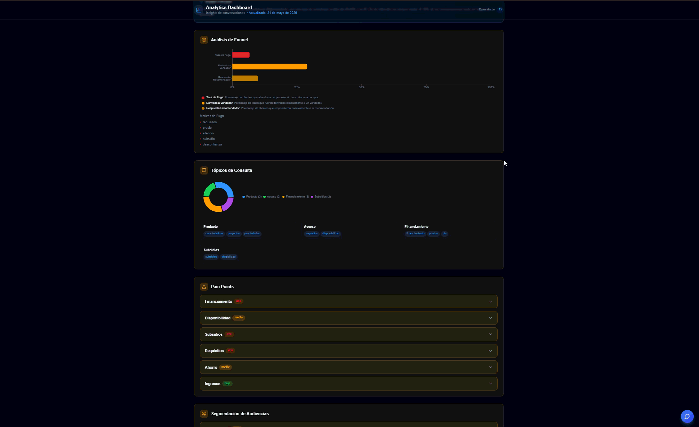
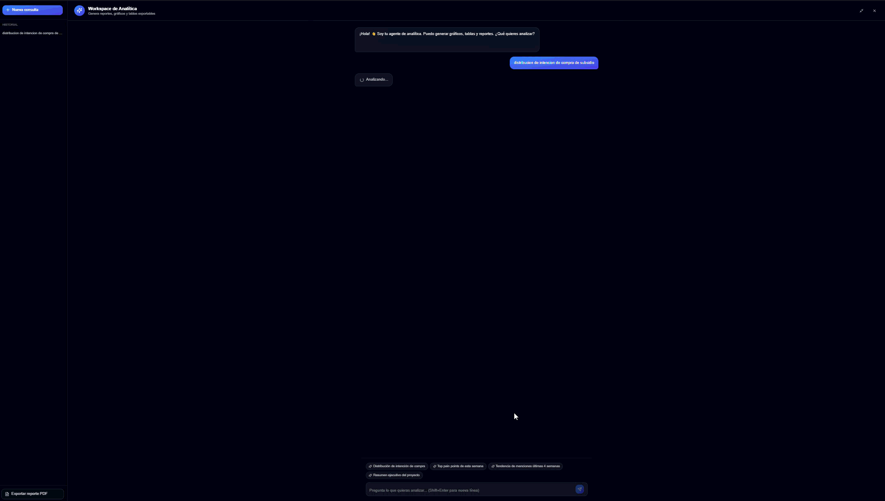

# Socovesa Jobs Insights Pipeline

AI-powered commercial insights pipeline with AWS Bedrock, S3 snapshots, a RAG analytics Lambda, and reusable Python modules for batch insight generation.

## Demo

### Product Walkthrough



### Analytics Agent



## Run

Create your local environment file from the template:

```bash
cp .env.example .env
```

Then fill in your AWS buckets, Bedrock models, and Knowledge Base IDs. Do not commit `.env`.
The S3 input/output prefixes are also configured there, so internal bucket paths do not need to be hardcoded in source.

```bash
source .venv/bin/activate
python AIforInsights.py --labels subsidio
```

The old single-file script has been split into a package:

- `AIforInsights.py`: thin CLI entry point.
- `socovesa_jobs/config.py`: environment settings, S3 prefixes, model IDs.
- `socovesa_jobs/aws_clients.py`: AWS client factory.
- `socovesa_jobs/state.py`: pipeline state and completion flags.
- `socovesa_jobs/decisions.py`: deterministic compression and parallelization rules.
- `socovesa_jobs/actions.py`: pipeline action handlers.
- `socovesa_jobs/pipeline.py`: orchestration loop.
- `socovesa_jobs/compression.py`: conversation compression, validation, cache.
- `socovesa_jobs/bedrock_client.py`: Bedrock calls and JSON extraction.
- `socovesa_jobs/preprocessing.py`: input validation and conversation merge.
- `socovesa_jobs/insights_dataframe.py`: structured insights dataframe creation.
- `socovesa_jobs/aggregates.py`: aggregate metrics.
- `socovesa_jobs/historical.py`: weekly snapshots and comparisons.
- `socovesa_jobs/outputs.py`: S3 writes and Knowledge Base sync.
- `socovesa_jobs/text_features.py`: TF-IDF customer language extraction.
- `socovesa_jobs/rag_analytics/`: reusable RAG analytics service for the API/Lambda agent.
- `lambda_functions/analytics_rag/`: AWS Lambda adapter for the RAG analytics API.
- `prompts/`: Jinja prompt templates.

Dependencies are listed in `requirements.txt`. The entry point no longer installs packages at runtime.

## Analytics RAG Lambda

Keep Lambda-specific code in:

```text
lambda_functions/analytics_rag/lambda_function.py
```

Keep reusable Lambda business logic in:

```text
socovesa_jobs/rag_analytics/
```

This separation lets the Lambda stay as a small HTTP/CORS adapter while the retrieval,
tool execution, snapshot loading, and answer generation can be tested and reused locally.

Handler:

```text
lambda_functions.analytics_rag.lambda_function.lambda_handler
```

Required environment variables:

- `AWS_REGION`
- `KB_ID` or `BEDROCK_KB_ID`
- `MODEL_MAIN` or `MODEL_ID`
- `S3_BUCKET`
- `OUTPUT_BUCKET`
